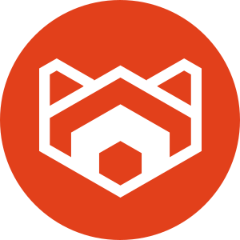
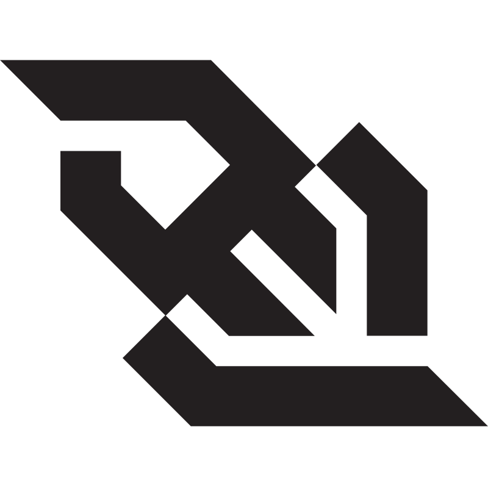

<!-- Top section -->
 
<table align="center" cellspacing="0" cellpadding="0">
    <tr>
        <td align="center" valign="middle">
            
        </td>
        <td align="center" valign="middle">
            
        </td>
    </tr>
</table>

    <h3>Connect with me:</h3>
    
    
    

## 👤 About Me
- 💼 Backend-leaning software engineer building production APIs and distributed services with **Django** and **NestJS**
- 🛠️ I care about the whole delivery path: data (PostgreSQL · MySQL · MongoDB), messaging (RabbitMQ · Kafka · Redpanda), containers (Docker · Podman), and shipping to AWS / GCP
- 🧠 Currently digging into ML inference pipelines with ONNX Runtime and Ollama
- 🔧 Tinkerer at heart — Arduino, automation scripting, and homelab-style experiments
- 📫 Best reached via LinkedIn, or open a PR on one of my repos

---

## 🐍 🛢️ 🖧 Backend

    
     
    
    

## 💻 🌐 ⚛️ Frontend

    

## ☁️ 💸 🛠️ Cloud

    

## 🧠 Machine Learning · Deep Learning · MML

    
    

## 👨🏻‍💻 📖 Programming Languages

    

## 🚀 DevOps

    

## 🤓 ☝️ Miscellaneous

    
     
    

---

<!-- Bottom section -->
<table align="center" cellspacing="0" cellpadding="0">
    <tr>
        <td align="center" valign="top">
            
        </td>
        <td align="center" valign="top">
            
        </td>
    </tr>
    <tr>
        <td colspan="2" align="center">
            
        </td>
    </tr>
    <tr>
        <td colspan="2" align="center">
            
        </td>
    </tr>
</table>
